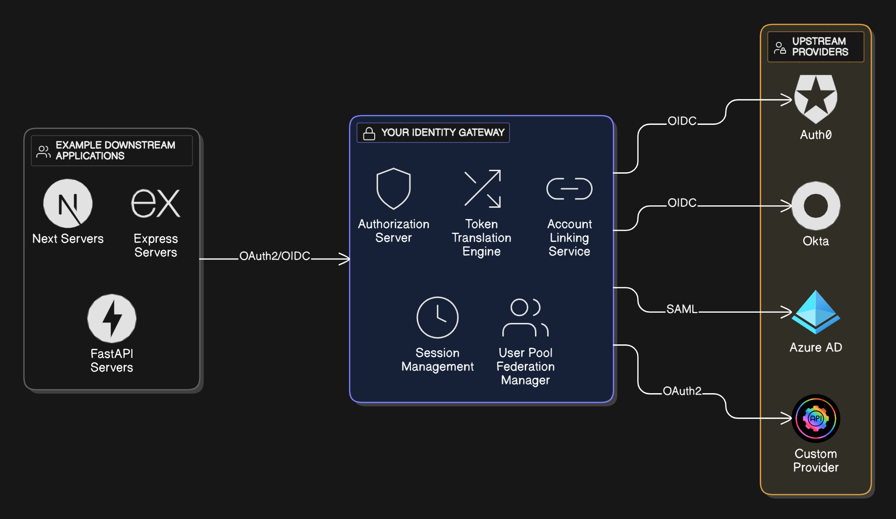
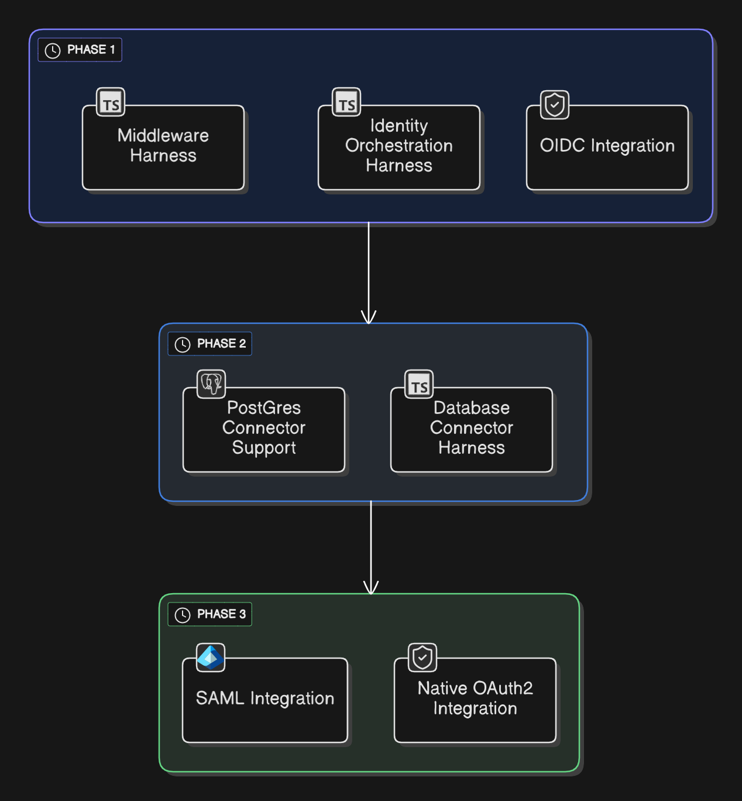

# Intro

An open-source, composable authentication framework project providing secure OAuth/OIDC integrations,
designed as a reusable backbone for enterprise-grade applications.

> ⚠️ **WARNING**: This project is currently a prototype template under construction and is not fit for production, or
> general usage, yet.

Once we are production-ready, we'll keep development consistent, and most importantly, non-intrusive to your changes.

**Why would you want to use Passage?**

- Organizations have **identity sprawl**: Auth0 for customers, Okta for employees, custom solutions for partners
- No clean way to present a unified identity interface to internal applications
- Each identity provider has different APIs, token formats, user schemas
- Applications end up with brittle multi-provider integration logic
- Migration between providers is organizationally traumatic

> 📑 **Conceptual / Vision Diagram of Passage**
> 

## Readme Directory

This readme is only an introductory overview of what Passage does.
Setup, technical docs, and diagrams can be found in the [readme](./readme) directory.

## Superpower your development!
Uses the Bun as a package manager and runtime for blazing fast speeds, especially for Express.js (https://bun.com/).

> We aim to make this project as easy to use as possible, loading-up on secure and powerful developer tools:
> - Git
> - Docker
> - Bun
> - Task (a modernized GNU-make; check out [Taskfile.dist.yml](./Taskfile.dist.yml)!)

> **Timeline of Development**
> 
