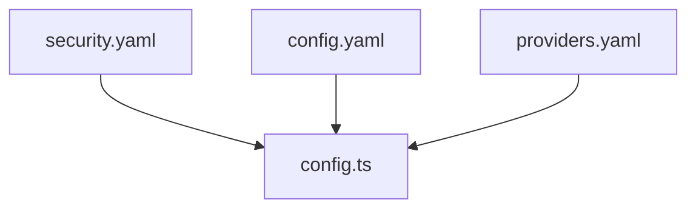

# Configuration of Passage

---

## Config Structure

---

## Providers

### Adding an OIDC Provider

> "OpenID Connect, popularly abbreviated as OIDC, is a protocol that enables different types of applications
> to support authentication and identity management in a secure, centralized, and standardized way. Apps
> based on the OpenID Connect protocol rely on identity providers to handle authentication processes
> for them securely and to verify the identities (i.e., personal attributes) of their users."
> - From the OIDC Handbook by Bruno Krebs of Auth0 (pg. 19)

#### Adding the Provider to the `providers.yaml` file

Within the `/config/` directory, modify the `providers.yaml` file.

